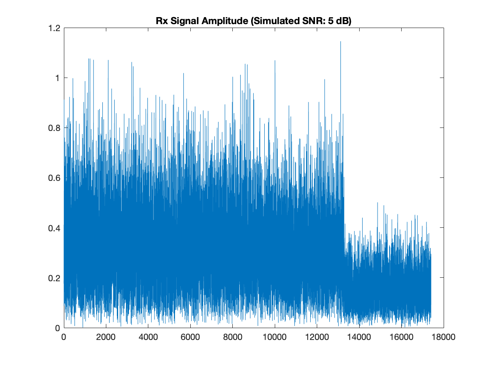
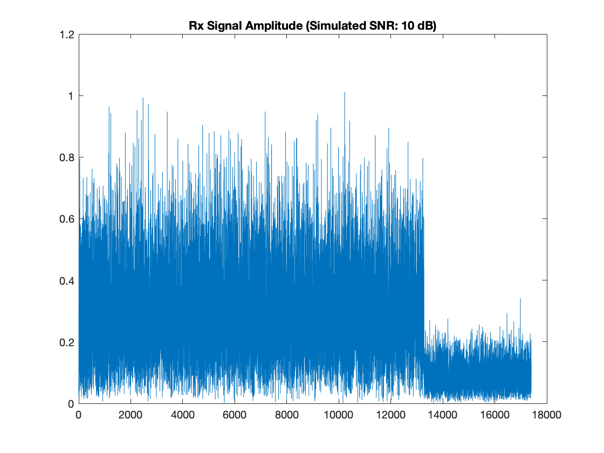
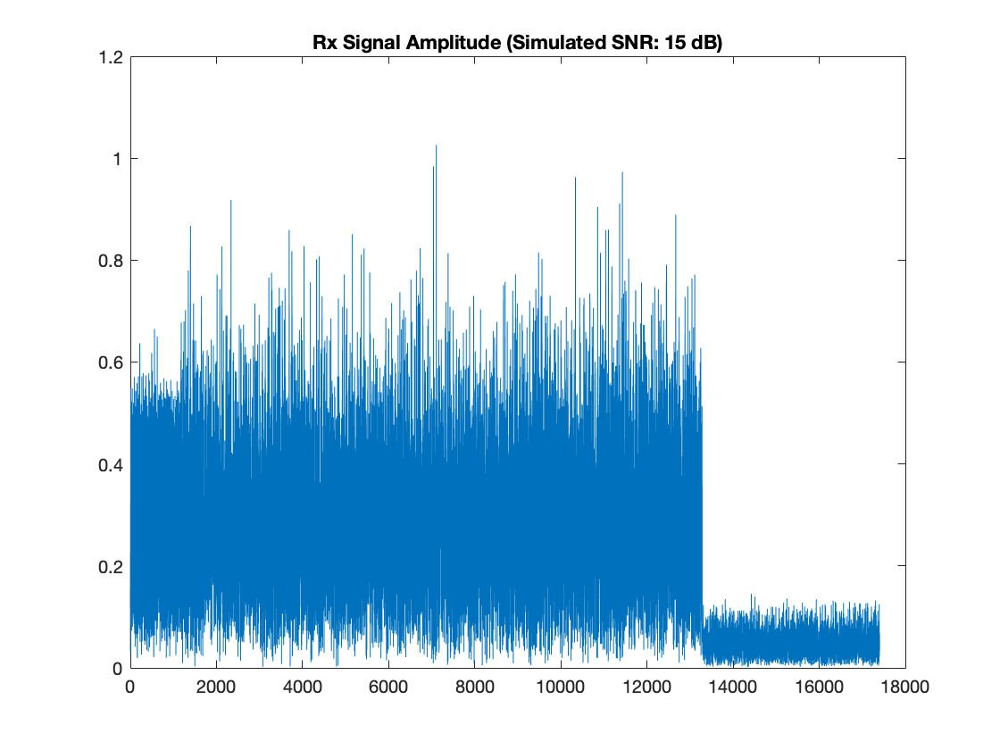
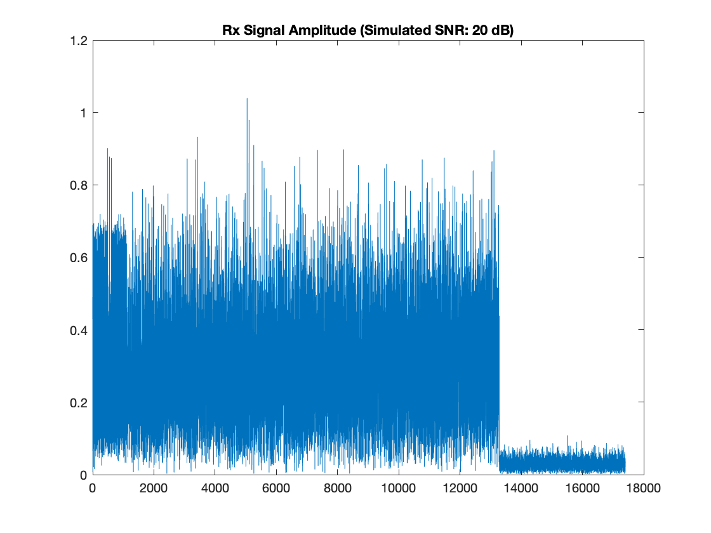
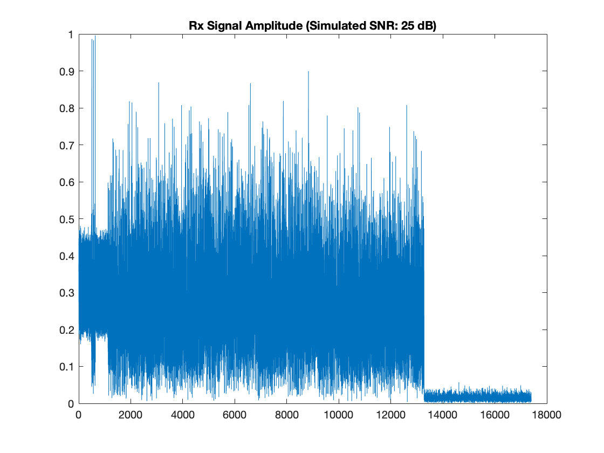
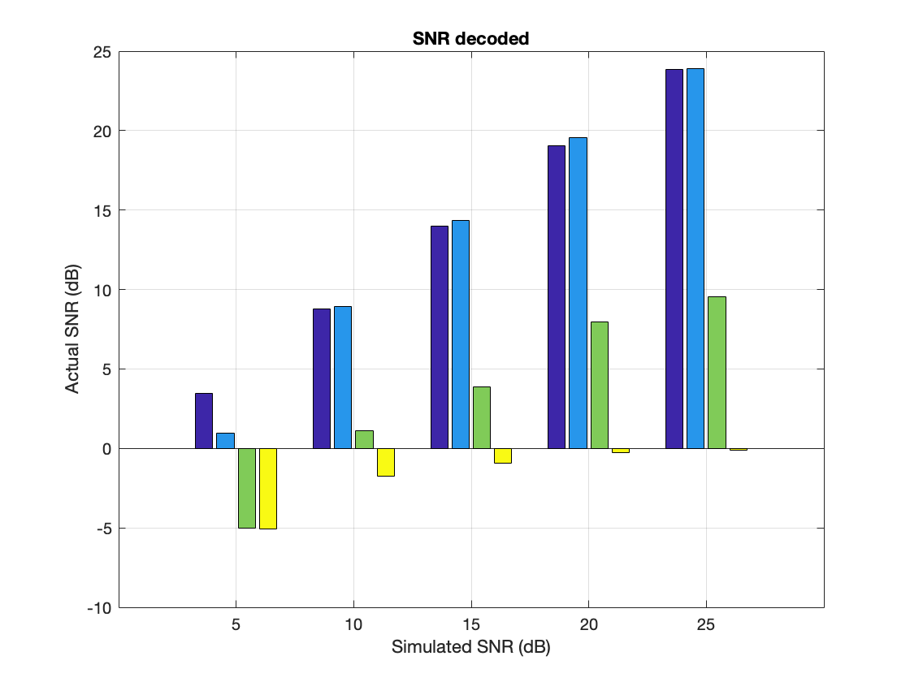

# Interference Nulling in Simulation

In this repository, we are going to simulate "interference nulling" in simple MIMO OFDM with BPSK demodulation by using the example code on [WARPLab](https://warpproject.org/trac/wiki/WARPLab/Examples/OFDM) `wl_example_siso_ofdm_txrx.m​`. This repository is extended from my another repository - [Simple SISO OFDM MATLAB simulation](https://github.com/yungshenglu/Simple_SISO_OFDM).

> **NOTCIE:** This repository is the assignment in NCTU course "Wireless Communication Systems 2018". If you are taking this course, please do not duplicate from this repository. All rights reserved.

---
## Description

The sample code `wl_example_siso_ofdm_txrx.m​` follows the following steps.
1. Generate OFDM transmit samples
2. Send samples via WARP or Simulation transmission
3. Decode the received samples
4. Calculate SNR / channels and plot

In the part of signal generation,
1. Generate preambles
2. Generate digital bits
3. Modulate digital bits to frequency-domain samples
4. Add pilot samples
5. Convert frequency sample to time samples via FFT
6. Insert CP (Cyclic Prefix)
7. Reshape symbols to 1D samples

In the part of decoding,
1. Packet detection
2. CFO correction (useless in simulation)
3. Channel estimation
4. Remove CP
5. Convert time samples to frequency samples via FFT
6. Decode frequency samples
7. SFO correction

### Interference Nulling Simulation

1. Modify [Simple SISO OFDM MATLAB simulation](https://github.com/yungshenglu/Simple_SISO_OFDM) Code (Tx) - `signal_gen.m`
    * Extend the code to `Tx1` (antenna 1) and `Tx2` (antenna 2)
        * A vector of digital bits (`0` or `1`)
        * Modulate them to two sequences of frequency-domain signals ($X[k]$)
    * Generate random channels $H_1[k]$ and $H_2[k]$
        * In Matlab, `H_i[ k ] = ( randn() + 1i * randn() ) / sqrt( 2 )`
        * One channel for each subcarrier across all symbols
    * Precode frequency-domain signals by unit beamforming vector $w$
        * Antenna 1: $X_1’[k] = w_1[k] X[k]$
        * Antenna 2: $X_2’[k] = w_2[k] X[k]$
        * $(w_1[k], w_2[k])$ is a unit vector, i.e., $w_1^2[k] + w_1^2 [k]= 1$.
    * Multiply the frequency-domain signals by the randomly generated unit frequency-domain channel
        * $Y_1 = H_1[k] * X_1’[k]$
        * $Y_2 = H_2[k] * X_2’[k]$
        * Convert frequency-domain signals to time-domain signals $(y_1, y_2)$
2. Modify [Simple SISO OFDM MATLAB simulation](https://github.com/yungshenglu/Simple_SISO_OFDM) Code (Rx) - `decode.m`
    * Sum up the two time-domain signals
        * $y = y_1 + y_2$
    * Generate noise to simulate different SNR (as in [Simple SISO OFDM MATLAB simulation](https://github.com/yungshenglu/Simple_SISO_OFDM))
        * Make sure $(E[y_1^2 + y_2^2]) / N = \mathrm{SNR}$
        * Not $E[ (y_1 + y_2) ^ 2 ] / N = \mathrm{SNR}$
    * Learn the channel $H_1$ and $H_2$
    * Decode the received signal via SISO decoding (as in [Simple SISO OFDM MATLAB simulation](https://github.com/yungshenglu/Simple_SISO_OFDM))
    * Compare the SNR with and without precoding
        * `SNR-1`:
            * `Tx1` sends the non-precoded signals $y_1$ ($y_1 = ifft(H_1X)$) along, and Rx decodes $y_1$
        * `SNR-2`:
            * `Tx2` sends the non-precoded signals $y_2$ ($y_2 = ifft(H_2X)$) along, and Rx decodes $y_2$
        * `SNR-orig`:
            * `Tx1` and `Tx2` send the non-precoded signals simultaneously ($y = ifft(H_1 X_1 + H_2 X_2)$)
            * `Rx` decodes the combined original signals
        * `SNR-null`:
            * `Tx1` and `Tx2` send precoded signals simultaneously ($y = ifft(H_1 W_1 X_1 + H_2 W_2 X_2)$)
            * `Rx` decodes the combined precoded signals
3. Plot the amplitude of the combined signal, `abs(y)` (SNR: 10dB)
4. Plot the SNR of the signal
    * Only `Tx1`
    * Only `Tx2`
    * Combined signal without precoding
    * Combined signal with precoding

---
## Execution

> **NOTICE:** Make sure you have already installed MATLAB on your machine

1. Open your MATLAB IDE and run `simulation.m`
2. If succeed, you will get some figures as follow:
    * Rx Signal Amplitude (Simulated SNR: 5 dB)
        
    * Rx Signal Amplitude (Simulated SNR: 10 dB)
        
    * Rx Signal Amplitude (Simulated SNR: 15 dB)
        
    * Rx Signal Amplitude (Simulated SNR: 20 dB)
        
    * Rx Signal Amplitude (Simulated SNR: 25 dB)
        
    * SNR decoded
        

---
## Contributor

> **NOTICE:** You can follow the contributing process [CONTRIBUTING.md](CONTRIBUTING.md) to join me. I am very welcome any issue!

* [David Lu](https://github.com/yungshenglu)

---
## License

> **NOTICE:** This repository is the assignment in NCTU course "Wireless Communication Systems 2018". If you are taking this course, please do not duplicate from this repository. All rights reserved.

[GNU GENERAL PUBLIC LICENSE Version 3](LICENSE)
